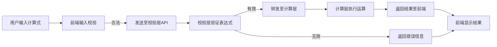

# Software_Engineering
# 网页计算器软件工程大作业README

## 一、项目概述
本项目为网页端计算器软件，实现基础计算功能及多层级校验处理流程。用户可在网页输入计算式，系统通过输入限制、校验层验证及计算层处理，最终返回结果或错误信息。


## 二、功能说明
### 1. 前端功能
- **界面展示**：提供可视化计算器界面，包含数字键、运算符键（+、-、×、÷）、等号键、清除键等。
- **输入显示**：实时展示用户输入的计算式，支持字符输入与回退修改。
- **历史信息显示**：按下等号以后，上实时显示上方显示历史的输入信息以及返回的结果。
- **输入限制**：
  - 禁止连续输入多个运算符（如"1++2"）；
  - 限制非法字符输入（仅允许数字、运算符及小数点）；
  - 避免以运算符开头（如"+123"）。

### 2. 后端功能
- **校验层**：
  - 验证计算式合法性（如括号匹配、除数为零、无效表达式等）；
  - 过滤非法格式（如多余运算符、非数字字符混入）。
- **计算层**：
  - 解析合法计算式，调用数学引擎完成计算；
  - 返回计算结果或错误信息至前端。


## 三、技术架构
### 1. 技术栈
- **前端**：HTML/CSS/JavaScript（基于Vue2框架）
- **后端**：Python（计算逻辑模块）
- **通信协议**：HTTP接口（JSON格式数据传输）

### 2. 流程示意图



## 四、安装与运行
### 1. 环境要求
- Node.js ≥ v14.0.0
- Python ≥ v3.8.0
- npm/yarn 包管理工具

### 2. 部署步骤
#### （1）前端部署
```bash
# 进入前端目录
cd Software_Engineering/vue-calculator-master
# 启动开发服务器
npm run serve
```

#### （2）后端服务启动
```bash

```

#### （3）计算模块运行（Python）
```bash
# 进入计算模块目录
cd calculator_engine
# 启动服务（需提前安装Flask）
python app.py
```


## 五、接口文档
### 1. 校验与计算接口
- **URL**：`/api/calculate`
- **方法**：POST
- **请求参数**：
  ```json
  {
    "expression": "1+2×3"  // 需转义为"1+2*3"
  }
  ```
- **响应格式**：
  ```json
  {
    "status": "success/error",
    "data": {
      "result": "7",       // 计算结果（仅status为success时存在）
      "error": "非法表达式" // 错误信息（仅status为error时存在）
    }
  }
  ```


## 六、项目结构
```
Software_Engineering/
├─ vue-calculator-master/               # 前端代码
│  ├─ build/                # 定义项目构建过程
│  ├─ dist/                 # 打包优化后的源代码
│  └─ src/                  # 代码源文件
├─ backend/                # 后端服务
│  ├─ routes/              # API路由
│  ├─ middleware/          # 中间件（校验逻辑）
│  └─ package.json          # 依赖配置
├─ python_calculate/      # 计算核心模块（Python）
│  ├─ calculate.py               # 计算函数
│  ├─ calculate_flask.py               # Flask服务入口
│  └─ calculate_demo.py               # 调用示例
└─ README                 
```


## 七、团队分工
| 成员       | 职责描述                          |
|------------|-----------------------------------|
| 燕帅成       | 前端界面开发及交互逻辑            |
| 余鸿源       | 后端接口设计与校验层实现          |
| 李国鹏       | 计算模块开发及项目管理            |


## 八、联系方式
- **问题反馈**：在GitHub仓库提交Issue


## 九、版本说明
- **当前版本**：V1.0.0（2025-05-28）
- **待优化功能**：
  - 支持更多运算符（如平方、开根号）；
  - 历史记录存储功能；
  - 响应式布局适配移动端。

## 十、运行视频
链接: https://pan.baidu.com/s/1bh_I37z899DLkhJsD4UPnQ?pwd=s9et 提取码: s9et
